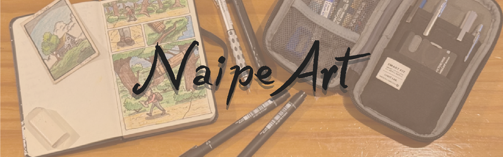

# 🎨 NaipeArt - Plataforma Educativa de Dibujo



## 📋 Descripción

NaipeArt es una plataforma educativa dedicada a la enseñanza del dibujo tradicional y digital. Este proyecto fue desarrollado como trabajo final para la materia **Introducción a la Programación Web** de la Universidad Abierta Interamericana (UAI).

La plataforma ofrece recursos educativos gratuitos para artistas de todos los niveles, desde principiantes hasta avanzados, incluyendo tutoriales, ejercicios prácticos, fundamentos teóricos y recursos descargables.

## 🎓 Información Académica

- **Institución:** Universidad Abierta Interamericana (UAI)
- **Materia:** Introducción a la Programación Web
- **Profesor:** Cardacci, Dario
- **Alumno:** Tabucchi, Damian
- **Año:** 2024-2025

## ✨ Características Principales

- ✅ **HTML Semántico:** Uso correcto de etiquetas semánticas (`<nav>`, `<section>`, `<article>`, `<header>`, `<footer>`)
- ✅ **Diseño Responsive:** Adaptable a diferentes dispositivos y tamaños de pantalla
- ✅ **Accesibilidad:** Implementación de buenas prácticas de accesibilidad web
- ✅ **SEO Optimizado:** Meta tags completos, Open Graph y Twitter Cards
- ✅ **Contenido Educativo:** Fundamentos de dibujo, tutoriales en video y recursos descargables
- ✅ **Galería Interactiva:** Visualización de ejercicios y obras artísticas
- ✅ **Sistema de Navegación Consistente:** Menú unificado en todas las páginas

## 📁 Estructura del Proyecto

```
NaipeArt/
├── index.html              # Página principal
├── tutoriales.html         # Videos tutoriales embebidos
├── fundamentos.html        # Teoría y ejercicios de dibujo
├── recursos.html           # Bibliografía y materiales
├── galeria.html            # Galería de obras y ejercicios
├── historia.html           # Historia del dibujo
├── sobremi.html           # Información del artista
├── faq.html               # Preguntas frecuentes
├── contacto.html          # Formulario de contacto y mapa
├── cuestionario.html      # Quiz interactivo
├── 404.html               # Página de error personalizada
├── css/
│   └── style.css          # Estilos principales
├── js/
│   └── cuestionario.js    # Lógica del cuestionario
├── resources/
│   ├── banner1920x600.png
│   ├── favicon.png
│   ├── materiales/        # Imágenes de materiales
│   ├── practicas/         # Imágenes de ejercicios
│   ├── sobremi/           # Galería personal
│   └── *.pdf              # Libros y recursos descargables
└── README.md              # Este archivo
```

## 🔧 Tecnologías Utilizadas

- **HTML5:** Estructura semántica y moderna
- **CSS3:** Estilos, diseño responsive, flexbox y grid
- **JavaScript:** Interactividad y cuestionario dinámico
- **APIs Externas:**
  - YouTube (embeds de videos educativos)
  - Google Maps (mapa de ubicación)
  - Instagram y YouTube (redes sociales)

## 🚀 Cómo Usar

### Ver el sitio en vivo
Visita: [https://damiantabucchi.github.io/NaipeArt](https://damiantabucchi.github.io/NaipeArt)

### Ejecutar localmente

1. Clona el repositorio:
```bash
git clone https://github.com/damiantabucchi/NaipeArt.git
```

2. Navega al directorio:
```bash
cd NaipeArt
```

3. Abre `index.html` en tu navegador preferido o usa un servidor local:
```bash
# Con Python 3
python -m http.server 8000

# Con Node.js (npx http-server)
npx http-server
```

4. Accede a `http://localhost:8000` en tu navegador

## 📚 Páginas y Contenido

### 🏠 Home (index.html)
- Introducción a NaipeArt
- Navegación principal
- Información académica del proyecto

### 🎬 Tutoriales (tutoriales.html)
- Videos educativos embebidos de YouTube
- Tutoriales de diferentes niveles (inicial, básico, intermedio)
- Temas: líneas, perspectiva, método Loomis

### 📖 Fundamentos (fundamentos.html)
- **Línea y Trazo:** Ejercicios básicos, intermedios y avanzados
- **Formas 2D:** Círculos, cuadrados, triángulos
- **Formas 3D:** Cubos, esferas, cilindros
- **Perspectiva:** 1, 2 y 3 puntos de fuga
- **Teoría del Color:** Círculo cromático y paletas

### 📦 Recursos (recursos.html)
- Bibliografía recomendada (Andrew Loomis, etc.)
- PDFs descargables gratuitos
- Materiales de dibujo recomendados con imágenes
- Descripción de herramientas (lápices, gomas, tabletas)

### 🖼️ Galería (galeria.html)
- Ejercicios de práctica visualizados
- Obras del artista
- Referencias históricas (da Vinci, Schiele)

### 📜 Historia (historia.html)
- Historia del dibujo desde el arte rupestre
- Evolución por épocas: Antigüedad, Edad Media, Renacimiento
- Arte moderno y era digital
- Línea de tiempo resumida

### 👤 Sobre Mí (sobremi.html)
- Biografía del artista
- Filosofía de NaipeArt
- Galería personal de trabajos

### ❓ FAQ (faq.html)
- Preguntas frecuentes sobre aprender a dibujar
- Consejos sobre materiales
- Información sobre práctica y progreso

### 📧 Contacto (contacto.html)
- Formulario de contacto funcional
- Mapa de Google Maps embebido
- Información del alumno y la institución

### 📝 Cuestionario (cuestionario.html)
- Quiz interactivo sobre fundamentos del dibujo
- Generado dinámicamente con JavaScript
- Feedback inmediato de respuestas

### ⚠️ 404 (404.html)
- Página de error personalizada
- Redirección automática después de 8 segundos
- Navegación rápida disponible

## 🎨 Características de Diseño

### Paleta de Colores
- **Principal:** #7a5a3a (marrón cálido)
- **Fondo:** Textura de papel (#f5f5dc)
- **Texto:** Negro y tonos oscuros para legibilidad
- **Acentos:** Colores tierra y neutros

### Tipografía
- Fuentes legibles y profesionales
- Jerarquía clara de títulos (h1-h3)
- Espaciado apropiado para lectura

### Responsive Design
- Mobile First approach
- Breakpoints para tablets y desktop
- Imágenes optimizadas con lazy loading
- Navegación adaptable

## 🔍 SEO y Metadata

Cada página incluye:
- Meta description optimizada
- Keywords relevantes
- Open Graph tags para redes sociales
- Twitter Cards
- Canonical URLs
- Alt text en todas las imágenes

## ♿ Accesibilidad

- Estructura semántica HTML5
- Contraste de colores adecuado
- Texto alternativo en imágenes
- Labels en formularios
- Navegación por teclado
- ARIA labels donde es necesario

## 📊 Validación

El código ha sido validado según:
- ✅ W3C HTML Validator
- ✅ W3C CSS Validator
- ✅ Lighthouse (Performance, Accessibility, Best Practices, SEO)

## 🤝 Contribuciones

Este es un proyecto académico, pero sugerencias y feedback son bienvenidos:
- Reporta bugs o problemas en la sección Issues
- Sugiere mejoras o nuevas características
- Comparte recursos educativos adicionales

## 📞 Contacto

- **Email:** damian.tabucchi@alumnos.uai.edu.ar
- **Instagram:** [@naipeart](https://instagram.com/naipeart)
- **YouTube:** [@naipeart](https://youtube.com/@naipeart)

## 📄 Licencia

Este proyecto es de código abierto y está disponible para fines educativos. Los contenidos de terceros (libros de Andrew Loomis, videos de YouTube) mantienen sus licencias originales.

## 🙏 Agradecimientos

- Andrew Loomis por sus invaluables libros de dibujo
- Los creadores de contenido educativo en YouTube
- La comunidad artística que inspira constantemente
- UAI y el profesor Dario Cardacci por la guía académica

## 📈 Roadmap Futuro

- [ ] Sistema de usuarios y login
- [ ] Galería de estudiantes
- [ ] Foro de discusión
- [ ] Más ejercicios interactivos
- [ ] App móvil nativa
- [ ] Sistema de progreso y badges

---

**Desarrollado con ❤️ por Damian Tabucchi | 2024-2025**
